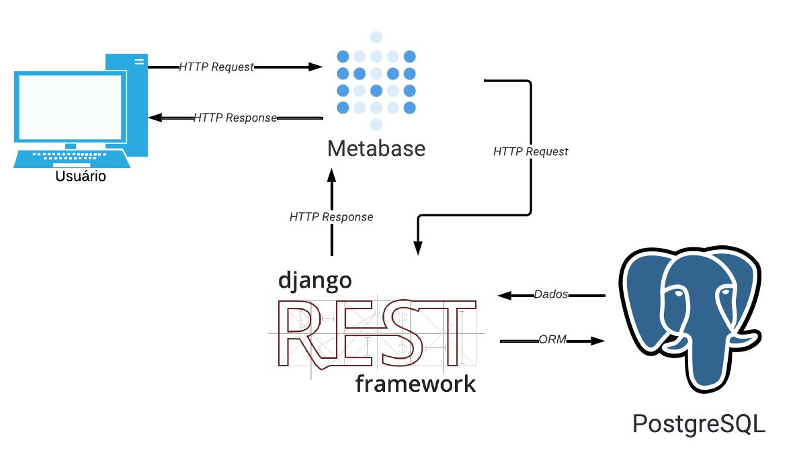
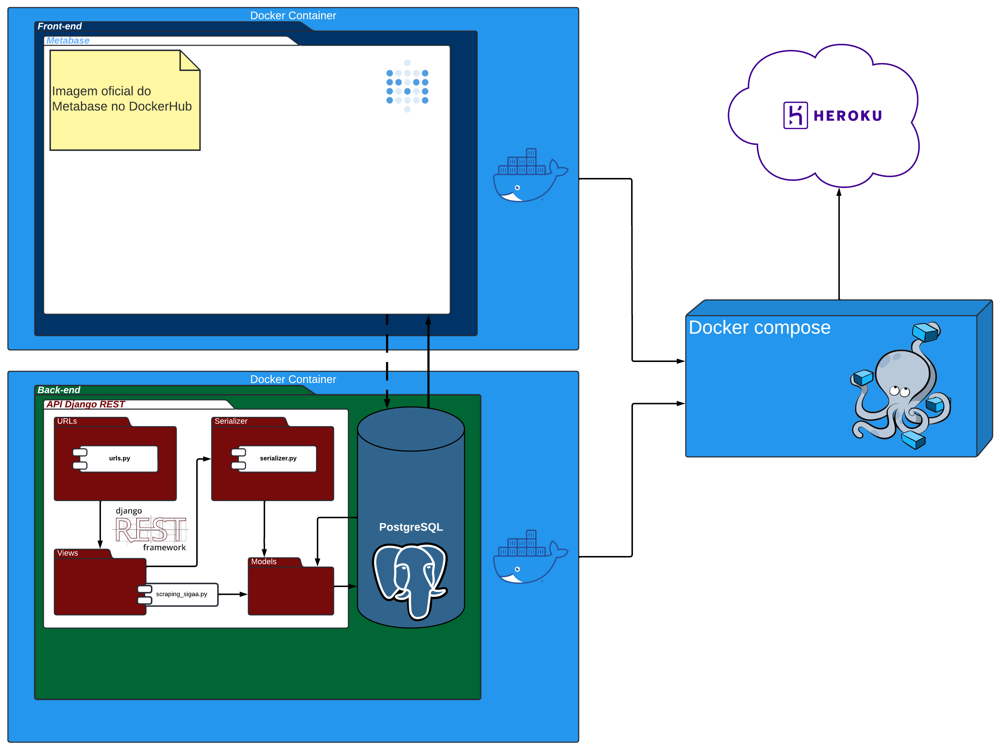

# Histórico de versões

|Data|Versão|Descrição|Autor|
|-|-|-|-|
|30/01/2022|0.1|Criação do documento de arquitetura|Guilherme|
|31/01/2022|0.2|Adição do tópico de referências|Guilherme|
|01/02/2022|0.3|Listagem das restrições da arquitetura|Arthur|
|01/02/2022|0.4|Definição do Escopo do Projeto|Guilherme|
|01/02/2022|0.5|Definição de Metas da Arquitetura|Thiago O. e Pedro|
|07/02/2022|0.6|Adição do tópico de visão geral do projeto|João Paulo|
|15/02/2022|0.7|Adição dos tópicos faltantes: Visão de casos de uso, Visão Lógica, Tamanho e Desempenho. Tópicos 3 e 4 alimentados com novas informações. Pequenos erros corrigidos.|João Paulo|
|02/03/2022|0.8|Adição do diagrama de pacotes|Guilherme Barbosa e Gabriel Mariano|
|03/03/2022|0.9|Adição do diagrama de casos de uso|Guilherme Santos|
|05/03/2022|0.9.1|Revisão geral dos documentos do projeto|Adne Moretti e Matheus Pimentel Leal|
|26/03/2022|0.9.2|Atualização do escopo e pequenas correções|Gabriel Moretti e Matheus Pimentel Leal|
|19/04/2022|0.9.3|Adição dos tópicos 2.1, 4.1 e correções|Letícia Aires|
|22/04/2022|0.9.8|Adição do tópico 5.1, descrição das tecnologias, refatoração de diagramas e tabelas de funcionalidades|Matheus Pimentel Leal|
|23/04/2022|1.0|Adição do tópico 6 e revisão geral do documento|Matheus Pimentel Leal|

# 1. Introdução

## 1.1 Objetivo

 O objetivo deste documento é oferecer, de modo claro e geral, a visão arquitetural do projeto <i>INDICAA</i>, trazendo consigo as características necessárias para os controles de suas atividades arquiteturais, moldando, assim, todo procedimento para o desenvolvimento do sistema. Esse documento também se dispõe a elucidar quais foram as motivações que levaram a equipe a tomar decisões a respeito dessa arquitetura.  

## 1.2 Escopo

  No contexto da pandemia, a gestão de espaços se tornou fundamental para o bom funcionamento da <i>UnB</i>. Nesse contexto, a equipe de coordenação voltou seus esforços para realizar uma boa divisão das disciplinas e atividades no geral de acordo com o espaço existente. Para tal, a visualização da divisão dos espaços de acordo com os períodos do dia é essencial para uma melhor tomada de decisões pelos gestores, o que impactará diretamente a execução das atividades acadêmicas da universidade.

 

 Nesse contexto, o objetivo do projeto é proporcionar uma melhor organização das informações disponibilizadas pelo nosso site acadêmico. Sendo assim, os coordenadores terão a possibilidade de visualizar a quantidade de disciplinas por curso, a quantidade de vagas ofertadas, a quantidade de alunos matriculados e a quantidade de salas disponíveis. Por meio dessas funcionalidades, a análise, o compartilhamento e o monitoramento de informações será mais simples, ajudando tanto a parte de gerenciamento e controle da disponibilização de disciplinas por parte dos coordenadores como a própria matrícula em disciplina por parte dos discentes. 

## 1.3 Definições, acrônimos e abreviações

|Sigla |Significado |
--|--
|**UnB**| Universidade de Brasília
|**FGA**| Faculdade do Gama 
|**MDS**| Métodos de Desenvolvimento de Software
|**SIGAA**| Sistema Integrado de Gestão das Atividades Acadêmicas
|**FU**| Funcionalidade de Usuário
|**BI**| Business Intelligence
|**SQL**| Standard Query Language
|**ORM**| Object–relational mapping
|**REST**| Representational State Transfer

## 1.4 Visão Geral

Este documento está dividido em 6 grandes tópicos com subdivisões e tem como objetivo final detalhar as características arquiteturais do projeto, bem como seus requisitos e motivações. Os tópicos e a seção de referências podem ser encontrados a seguir:

| |Tópico |Descrição |
|-|-|-|
|**1**|**Introdução**| Fornece ao leitor uma visão geral do conteúdo abordado no documento
|**2**|**Representação Arquitetural**| Detalha a arquitetura utilizada no projeto e como ela está organizada
|**3**|**Metas e Restrições da Arquitetura**| Descreve os objetivos do projeto, bem como suas restrições, do ponto de vista arquitetural
|**4**|**Visão dos casos de uso**| Descreve as partes significativas do ponto de vista da arquitetura do modelo de casos de uso
|**5**|**Visão Lógica**| Descreve as partes significativas do ponto de vista da arquitetura do modelo de design
|**6**|**Desempenho e Qualidade**| Descreve as características de desempenho do Software, bem como as restrições estabelecidas e possíveis falhas
|**7**|**Referências**| Fornece ao leitor uma visão geral das referência utilizadas durante a criação deste documento

# 2. Representação da Arquitetura

O <i>INDICAA</i> se baseia em realizar o scraping de dados do site acadêmica <i>SIGAA</i>, mais especificamente a seção de matérias ofertadas. O usuário acessa o aplicação <i>Metabase</i> por meio do naveagdor e assim, é possibilitada a visualização dos mesmos dados disponibilizados no sigaa, porém, de maneira mais visual e atrativa. Ele também pode realizar a criação de <i>dashboards</i> interativos por meio da interface do <i>Metabase</i>, gerar perguntas que retornam respostas com base nos dados obtidos por meio do scraping do <i>SIGAA</i>, realizar buscas diretamente no banco de dados por meio da linguagem <i>SQL</i> e criar coleções (que podem conter dashboards, perguntas e buscas <i>SQL</i> ao banco de dados).

## 2.1 Tecnologias

No que tange às linguagens e ferramentas utilizadas para desenvolvimento do software, tem-se:

               

## 
O WebDriver manipula um navegador nativamente, como um usuário faria, seja localmente ou em uma máquina remota usando o servidor Selenium, marca um salto em termos de automação do navegador.

## 
Django REST Framework ou DRF é uma biblioteca que permite a construção de APIs REST utilizando a estrutura do Django. Lançado em Fevereiro de 2011, o DRF, por funcionar sob a estrutura do Django, permite a construção de APIs em qualquer plataforma, seja Windows, macOS ou Linux.

## 
O Figma é um editor gráfico de vetor e prototipagem de projetos de design baseado principalmente no navegador web, com ferramentas offline adicionais para aplicações desktop para GNU/Linux, macOS e Windows

## 
Docker é um conjunto de produtos de plataforma como serviço que usam virtualização de nível de sistema operacional para entregar software em pacotes chamados contêineres. Os contêineres são isolados uns dos outros e agrupam seus próprios softwares, bibliotecas e arquivos de configuração.

## 
Canva é uma plataforma de design gráfico que permite aos usuários criar gráficos de mídia social, apresentações, infográficos, pôsteres e outros conteúdos visuais. Está disponível online e em dispositivos móveis e integra milhões de imagens, fontes, modelos e ilustrações.

## 
O Metabase é uma solução open-source de business intelligence  que permite que usuários possam construir, explorar, analisar e compartilhar gráficos e dashboards de forma simples.

## 
Heroku é uma plataforma de nuvem como serviço que suporta várias linguagens de programação.

## 
PostgreSQL é um sistema gerenciador de banco de dados objeto relacional, desenvolvido como projeto de código aberto.

## 
Python é uma linguagem de programação de alto nível, interpretada de script, imperativa, orientada a objetos, funcional, de tipagem dinâmica e forte.

## 
Discord é um aplicativo de voz sobre IP proprietário e gratuito, projetado inicialmente para comunidades de jogos.

# 3 Metas e Restrições da Arquitetura
## 3.1 Metas

Este projeto tem como meta fazer um painel com o intuito de mostrar os respectivos indicadores da lista de oferta do SIGAA listados a seguir:
 

- Quantidade de _disciplinas ofertadas_ por curso
- Quantidade de _vagas ofertadas_ por curso
- Quantidade de _alunos matriculados_ por curso
- Quantidade de _salas disponíveis_ por curso

Para cumprir tais metas, será necessária a utilização de um <i>Web scraper</i> com o intuito de retirar as informações de ofertas de metérias do <i>SIGAA</i>, salvá-las em um banco de dados e utilizar ferramentas de <i>BI</i> para a visualização dos indicadores.

## 3.2 Restrições

- Possuir conexão com a internet
- Dependência da plataforma <i>SIGAA</i>
- Eventual demora no tempo de resposta para atualização das informações no <i>SIGAA</i>

# 4. Visão de casos de uso

## 4.1 Diagrama de casos de uso

## 4.2 Descrição dos casos de uso

### FU01 - Pesquisar
|||
------|------
**Descrição**| Esta funcionalidade permite ao usuário a pesquisa a partir de um texto fornecido, no _Metabase_ |
**Atores**| Usuário |
**Pré-condições**| O campo de pesquisa deve ter sido prenchido pelo usuário  |
**Pós-condições**| Os resultados correspondentes serão disponibilizados na tela ao usuário |
**Fluxo principal**|1. O usuário abre a aplicação   2. O usuário clica no campo de pesquisa   3. O usuário preenche o campo de pesquisa  4. A pesquisa é realizada e o usuário tem acesso aos resultados |
**Fluxo Alternativo**| **FA01 - Barra de pesquisa selecionada mas não preenchida**   Caso o usuário selecione a barra de pesquisa mas não a preencha, sugestões com base nos dados recentemente vistos aparecerão. |
**Fluxo de exceção**| **FE01 - Conexão**   Se houver algum problema de conexão, a operação pode não ser concluída com sucesso |

### FU02 - Visualizar coleções e bancos de dados
|||
------|------
**Descrição**| Esta funcionalidade permite ao usuário a visualização dos dados inseridos em coleções ou a visualização dos dados dos bancos de dados conectados, no _Metabase_ |
**Atores**| Usuário |
**Pré-condições**| O usuário deve ter ido até a seção _Our analytics_ e selecionado um item da coleção, ou até o botão _Browse data_ na barra superior e selecionado um banco de dados |
**Pós-condições**| O usuário deve ter conseguido visualizar os dados de um item da coleção ou os dados inseridos no banco de dados |
**Fluxo principal**|1. O usuário vai até a seção _Our analytics_   2. O usuário clica em _Browse all items_   3. O usuário visualiza uma lista com os itens disponíveis   4. O usuário seleciona um item da lista   5. A janela de visualização de dados aparece, e o usuário tem acesso aos dados |
**Fluxo secundário**|1. O usuário vai até a seção _Browse data_   2. O usuário clica em um banco de dados cadastrado   3. O usuário visualiza uma lista com as tabelas disponíveis   4. O usuário seleciona um tabela da lista   5. A janela de visualização de dados aparece, e o usuário tem acesso aos dados |
**Fluxo de exceção**| **FE01 - Conexão**   Se houver algum problema de conexão, a operação pode não ser concluída com sucesso |

### FU03 - Criar coleções e itens
|||
------|------
**Descrição**| Esta funcionalidade permite ao usuário a criação de coleções e itens no _Metabase_ |
**Atores**| Usuário |
**Pré-condições**| O usuário deve ter realizado a pesquisa |
**Pós-condições**| O usuário deve ter conseguido filtrar sua pesquisa tanto por modalidade quanto por disponibilidade |
**Fluxo principal**|1. O usuário realiza uma pesquisa[FU01]   2. O usuário visualiza as opçoes de filtragem á esquerda da pagina   |
**Fluxo de exceção**| **FE01 - Conexão**   Se houver algum problema de conexão, a operação pode não ser concluída com sucesso |

### FU04 - Arquivar Coleções e itens
|||
----- | ----- 
**Descrição** | Esta funcionalidade permite ao usuário arquivar coleções e itens no _Metabase_ |
**Atores** | Usuário |
**Pré-condições** | O usuário deverá ter criado ao menos um item ou coleção |
**Pós-condições** | A coleção ou item deve ter sido arquivada |
**Fluxo principal** | 1. O usuário vai até a seção _Our analytics_   2. O usuário seleciona um item ou coleção clicando nos '...' na extrema direita do item   3. O usuário clica em _Archive_.   5. A coleção ou item é arquivado  
**Fluxo de exceção** | **FE01 - Conexão**  Se houver algum problema de conexão, a operação pode não ser concluída com sucesso

### FU05 - Filtrar pesquisa

|||
----- | ----- 
**Descrição** | Esta funcionalidade permite ao usuário filtrar uma pesquisa com base nos parâmetros passados |
**Atores** | Usuário |
**Pré-condições** | O usuário deverá ter pesquisado algo [FU01] |
**Pós-condições** |  Serão apresentadas informações com base no filtro selecionado |
**Fluxo principal** | 1. O usuário preenche e faz uma pesquisa [FU01]    2. São apresentados os resultados da pesquisa   3. O usuário seleciona um dos seguintes filtos: _All results_, _Dashboards_, _Raw tables_ e _Questions_.   4. As informações filtradas aparecem na tela
**Fluxo de exceção** | **FE01 - Conexão**  Se houver algum problema de conexão, a operação pode não ser concluída com sucesso

### FU06 - Detalhar dados

|||
----- | ----- 
**Descrição** | Esta funcionalidade permite ao usuário ver mais detalhadamente os dados dispostos (seja por meio de gráficos ou números) |
**Atores** | Usuário |
**Pré-condições** | O usuário deverá estar visualizando algo [FU02] |
**Pós-condições** | Serão apresentadas informações mais detalhadas relativas ao dado selecionado |
**Fluxo principal** | 1. O usuário está visualizando uma coleção [FU02]    2. O usuário clica no título de um _card_ de dados   3. Os dados detalhados são mostrados ao usuário
**Fluxo secundário** | 1. O usuário está visualizando os dados de um banco de dados[FU02]    2. O usuário clica no id de um dado registrado no banco de dados   3. Os dados detalhados são mostrados ao usuário
**Fluxo de exceção** | **FE01 - Conexão**  Se houver algum problema de conexão, a operação pode não ser concluída com sucesso

### FU07 - Deletar coleções e itens

|||
----- | ----- 
**Descrição** | Esta funcionalidade permite ao usuário deletar coleções ou itens arquivados |
**Atores** | Usuário |
**Pré-condições** | O usuário deverá ter arquivado coleções ou itens [FU04] |
**Pós-condições** | A coleção ou item selecionado, será deletado |
**Fluxo principal** | 1. O usuário deve estar visualizando dados[FU02]   2. O usuário clica em _view archive_ na parte inferior da visualização de dados   3. O usuário está visualizando coleções e itens arquivados anteriormente [FU04]   4. O usuário descansa o cursor sobre o ícone do item que deseja deletar e o seleciona   5. O usuário seleciona a opção _Delete_ na parte inferior da visualização   6. A coleção ou dado selecionado, é deletado
**Fluxo de exceção** | **FE01 - Conexão**  Se houver algum problema de conexão, a operação pode não ser concluída com sucesso

# 5. Visão Lógica

## 5.1 Visão Geral

As ações do usuário em ambiente desktop, serão interpretadas pelo Metabase como eventos, onde cada evento está associado com um <i>Handler</i> que irá disparar uma ação. Algumas destas ações poderão ser tratadas no lado do cliente (<i>client side</i>), tais como ações de interatividade que não precisam de comunicação externa.

Já em outras ações, será necessária a consulta à um banco de dados no lado do servidor (<i>server side</i>). Assim, sendo necessário o envio de uma solicitação (<i>request</i>) ao servidor, utilizando o protocolo de requisições <i>HTTP</i> e tendo em vista as regras de interface <i>REST</i>

Assim que o servidor recebe a solicitação do cliente, será necessária a interpretação da requisição com base na <i>url</i> e no método <i>HTTP</i> utilizado. Essa computação é realizada no módulo <i>url dispatcher</i>, onde o mapeamento para 'ponto final' da aplicação é realizado, e o módulo que possui as informações solicitadas é disponibilizado.

Quando a aplicação <i>Django REST</i> está integrada com o <i>Django</i>, duas etapas são definidas. Primeiramente o <i>Django</i> verifica se a url requisitada faz parte da <i>API</i> que o <i>Django REST</i> fornece, se esta fizer parte, o <i>Django</i> passa o controle para o <i>Django REST</i> finalizar o processamento e o mapeamento da requisição.

Uma vez que a <i>url</i> já foi mapeada para o módulo que possui as informações requisitadas. Este, geralmente uma classe dos <i>models.py</i>, será responsável por utilizar o <i>ORM</i> para mapear um modelo da aplicação com um modelo do banco de dados. Após o devido mapeamento, o banco de dados irá retornar um conjunto de informações que serão tratadas pelo <i>Django REST</i>.

Já com os dados em mãos <i>Django REST</i>, poderá serializar as informações no formato padrão da <i>API</i>, geralmente no formato <i>JSON</i>. Esta serialização é responsável por definir uma interface que vários sistemas poderão consumir.

Uma vez que os dados já foram serializados, o <i>Django REST</i> passa o controle para o <i>Django</i>. Que será responsável por retornar uma respost para o lado do cliente.

Por fim, a resposta é obtida pelo <i>Metabase</i>, e agora com os dados requisitados em mãos, ele será responsável por fornecer esses dados o usuário da aplicação. O <i>Metabase</i> fica responsável pela disponibilização dos dados contidos no banco de dados, e o usuário pode realizar as ações definidas pelas funcionalidades do usuário (<i>FUs</i>).

# 6. Visão de implementação

## 6.1 Dicionário de dados

### Entidade: Unidade

|Atributo|Propriedades do atributo|Tipo de dado|Tamanho|Descrição|Exemplo|
|-|-|-|-|-|-|
|nome|Chave primária Obrigatório|varchar|255|Nome do departamento|"Faculdade do Gama"|

### Entidade: Materia

|Atributo|Propriedades do atributo|Tipo de dado|Tamanho|Descrição|Exemplo|
|-|-|-|-|-|-|
|codigoMateria|Chave primária Obrigatório|varchar|7|Codigo da Matéria|"FGA0003"|
|cargaHoraria|Obrigatório|varchar|3|Carga Horária da Matéria|"60h"|
|nome|Obrigatório|varchar|255|Nome da Matéria|"COMPILADORES 1"|

### Entidade: Turma

|Atributo|Propriedades do atributo|Tipo de dado|Tamanho|Descrição|Exemplo|
|-|-|-|-|-|-|
|docente|Chave primária Obrigatório|varchar|50|Nome completo do docente|"FABIO MACEDO MENDES"|
|codigoTurma|Chave primária Obrigatório|varchar|2|Código da Turma|"01" ou "A"|
|horario|Obrigatório|varchar|20|Horário da Turma seguindo o padrão do SIGAA|"5M1234 5T23"|
|vagasOfertadas|Obrigatório|int|---------|Quantidade de vagas ofertadas|40|
|vagasOcupadas|Obrigatório|int|---------|Quantidade de vagas ocupadas|0|
|local|Obrigatório|varchar|40|Local da aula da Turma|"remoto" ou "I10"|
|ano|Obrigatório|int|---------|Ano do Período|2021|
|semestre|Obrigatório|int|---------|Semestre do Período|2|

## 6.2 Diagrama de Pacotes

# 7 Referências
MATHEUS, Davi; et al. Documento de Arquitetura - Cheery Up. Disponível em: <https://fga-eps-mds.github.io/2020.2-CheeryUP/#/./wiki/Documents/Documento_de_Arquitetura?id=documento-de-arquitetura>. Acesso em: 30 jan 2022.
 
CARVALHO, Durval; et al. Documento de Arquitetura - Acácia. Disponível em: <https://fga-eps-mds.github.io/2019.2-Acacia/#/architecture_document?id=documento-de-arquitetura>. Acesso em: 30 jan 2022.
 
EDUARDO, Victor; et al. Documento de Arquitetura - AlligaBot. Disponível em: <https://fga-eps-mds.github.io/2021.1-AlligaBot/2021/08/03/documento-de-arquitetura/>. Acesso em: 07/02/2022.
