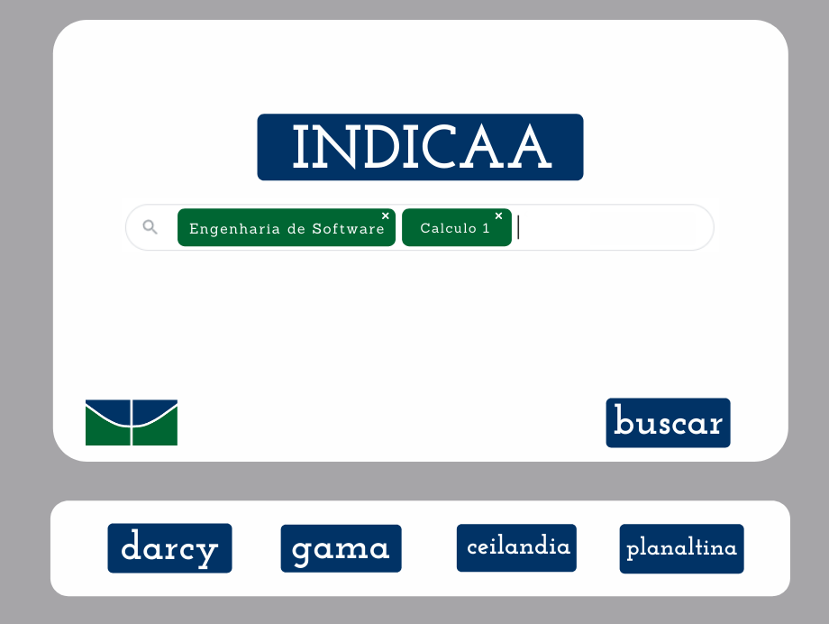
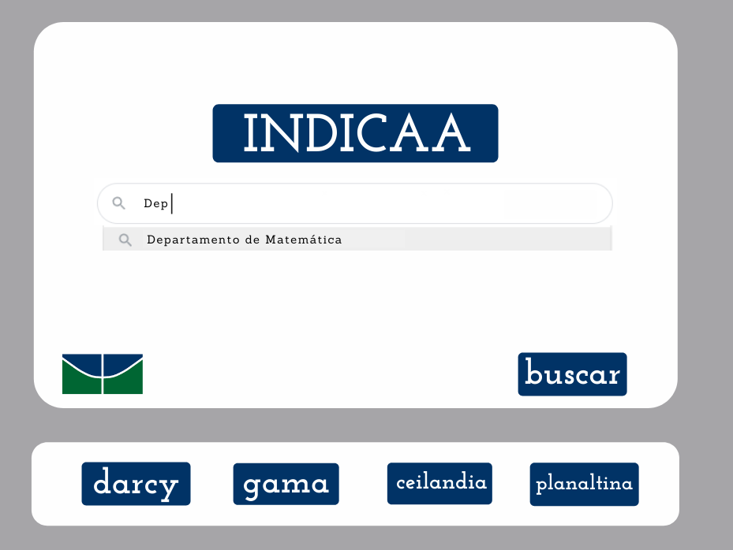
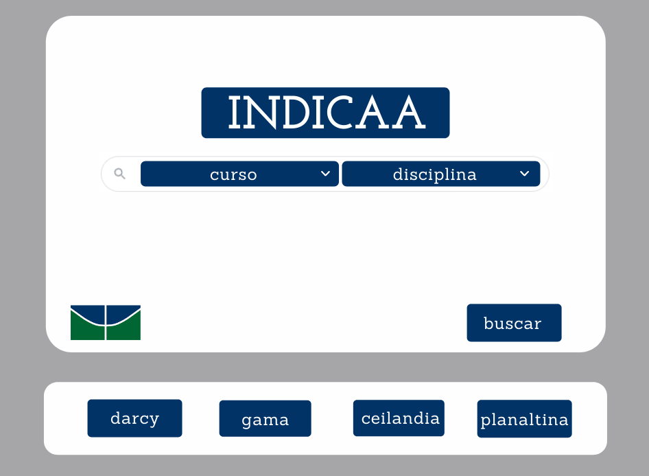

# Histórico de Revisão
| **Data**   	| **Versão** 	| **Modificação**                                                  	| **Autor(es)**              	|
|------------	|------------	|------------------------------------------------------------------	|----------------------------	|
| 11/02/2022 	|     0.1    	|                       Criação do documento                       	| Guilherme Barbosa Ferreira 	|
| 11/02/2022 	|     0.2    	| Adição dos tópicos de Introdução e Protótipo de Baixa Fidelidade 	| Guilherme Barbosa Ferreira 	|
| 13/02/2022 | 0.3 | Revisão das versões iniciais | Guilherme dos Santos Araújo
| 17/02/2022    |     0.4       | Adição da versão 1.1 e 2.2 | Guilherme Barbosa Ferreira, Caio César Oliveira, Thiago Oliveira Cunha, Gabriel Moretti de Souza
| 17/02/2022 | 0.5 | Adição de todo o Protótipo de Alta Fidelidade | Guilherme Barbosa Ferreira, Caio César Oliveira, Thiago Oliveira Cunha, Gabriel Moretti de Souza, Lucas Henrique Lima de Queiroz
21/02/2022 | 0.6 | Revisão do Protótipo | Gabriel Mariano da Silva
22/02/2022 | 0.7 | Correções em aspectos funcionais | Caio César Oliveira
03/03/2022 | 0.8 | Adição da logo e alterações visuais | Guilherme Barbosa Ferreira e Gabriel Moretti de Souza
11/04/2022 | 0.9 | Revisão geral do documento | Arthur taylor
18/04/2022 | 1.0 | Finalização do documento | Guilherme Barbosa Ferreira e Matheus Pimentel Leal

## 1. Introdução
Neste documento estão contidas as informações sobre o desenvolvimento do protótipo, abordando os protótipos de baixa fidelidade e de alta fidelidade, para melhor visualização da ideia do projeto.

## 2. Protótipo de Baixa Fidelidade
Sendo a melhor alternativa para o início do escopo do projeto, o protótipo de baixa fidelidade descarta as incertezas, testa conceitos, procura o desenvolvimento do projeto. 
Os protótipos a seguir foram desenvolvidos a partir de uma ideia inicial, versionando eles e adaptando de acordo com os requisitos do projeto.
### Versão 1 
### Versão 2 
### Versão 3 
### Versão 4 

## 3. Protótipo de Alta Fidelidade
Um protótipo de alta fidelidade (às vezes chamado de _high-fi_ ou _hi-fi_) é uma representação interativa do produto, baseada no computador ou em dispositivos móveis. Esse protótipo já apresenta maior semelhança com o design final em termos de detalhes e funcionalidade.  
Os protótipos de alta fidelidade abrangem não apenas a **interface da pessoa usuária (UI)** do produto em termos visuais e estéticos, mas também os aspectos da **experiência do(a) usuário(a) (UX)** em termos de interações, fluxo e comportamento.

## 3.1 Definição do Protótipo
Com a utilização do **Metabase**, a equipe do projeto INDICAA decidiu não desenvolver um front-end dedicado ao projeto.  
Por isso, a equipe responsável pela documentação do projeto, incluindo o GitHub Pages, optou pela utilização do MkDocs, um gerador de sites voltado para a construção e documentação de projetos. O tema escolhido do MkDocs foi o _Material for MkDocs_.
### [Protótipos de Alta Fidelidade](https://www.figma.com/file/jwle1wmYYdsTGcWYgGO24S/Front-end-INDICAA?node-id=0%3A1)

## 4. Referências
TERA. Prototipagem de alta fidelidade: o que é, quando, por que e como usar?. 23 mar. 2020. Disponível em: [https://medium.com/somos-tera/prototipagem-de-alta-fidelidade-635d745b662b](https://medium.com/somos-tera/prototipagem-de-alta-fidelidade-635d745b662b). Acesso em: 18 abr. 2022.
